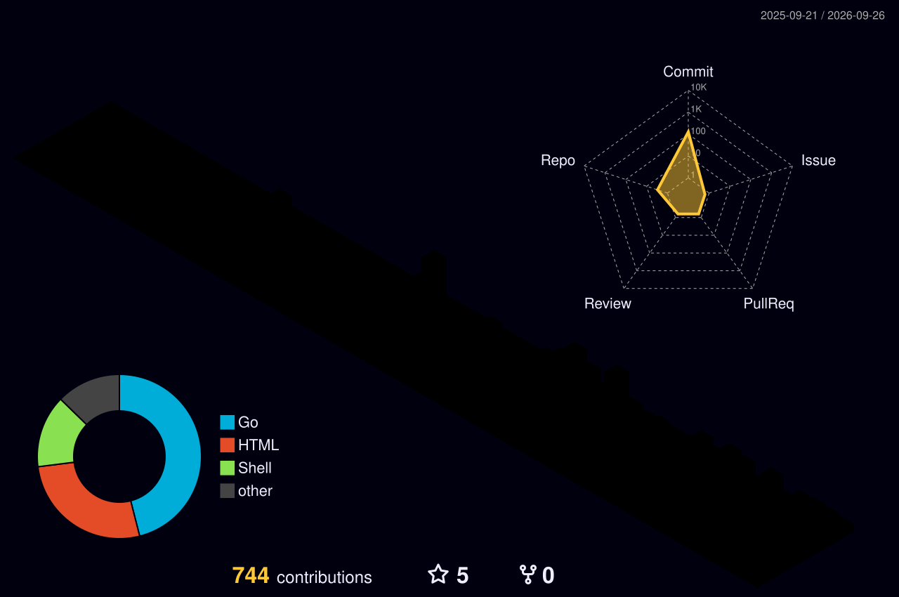

<!-- ========================================================= -->
<!--          PING-PHANTOM39 // PURPLE NEON UNIVERSE          -->
<!-- ========================================================= -->

  

  

  
  
  

 

  

---

<h2 align="center">💜 ABOUT THE PHANTOM</h2>

  <b>Linux enthusiast • DevOps learner • Go developer • Builder of strange ideas</b>

 

<table align="center">
<tr>
<td align="center" width="220">

### 🐧 Linux

Exploring systems,  
servers and internals.

</td>

<td align="center" width="220">

### ⚙️ DevOps

Automating infrastructure  
and deployment workflows.

</td>

<td align="center" width="220">

### 🐹 Go

Building fast, useful  
terminal applications.

</td>

<td align="center" width="220">

### ☁️ Cloud

Experimenting with  
modern infrastructure.

</td>
</tr>
</table>

 

  

---

<h2 align="center">🪐 PHANTOM UNIVERSE</h2>

  <i>Technologies currently orbiting my world.</i>

 

 

  ☁️ &nbsp;&nbsp;&nbsp;
  🪐 &nbsp;&nbsp;&nbsp;
  ✦ &nbsp;&nbsp;&nbsp;
  🌙 &nbsp;&nbsp;&nbsp;
  💜 &nbsp;&nbsp;&nbsp;
  ⚡ &nbsp;&nbsp;&nbsp;
  ✦ &nbsp;&nbsp;&nbsp;
  🪐 &nbsp;&nbsp;&nbsp;
  ☁️

---

<h2 align="center">🔮 WHAT I'M BUILDING</h2>

  

 

<table align="center">
<tr>

<td align="center">

### 🚀 BUILD

Turn ideas into  
working software.

</td>

<td align="center">

### 🧪 EXPERIMENT

Try technologies  
outside my comfort zone.

</td>

<td align="center">

### 🧠 UNDERSTAND

Learn what happens  
beneath the abstraction.

</td>

<td align="center">

### ⚡ AUTOMATE

Make computers handle  
the repetitive work.

</td>

</tr>
</table>

 

  <b>IDEA</b>
  &nbsp; ➜ &nbsp;
  <b>EXPERIMENT</b>
  &nbsp; ➜ &nbsp;
  <b>BUILD</b>
  &nbsp; ➜ &nbsp;
  <b>BREAK</b>
  &nbsp; ➜ &nbsp;
  <b>LEARN</b>
  &nbsp; ➜ &nbsp;
  <b>EVOLVE</b>

---

<h2 align="center">⚔️ TECH ARSENAL</h2>

<h3 align="center">Languages & Scripting</h3>

  

<h3 align="center">Infrastructure & DevOps</h3>

  

<h3 align="center">Databases & Backend</h3>

  

<h3 align="center">Developer Environment</h3>

  

---

<h2 align="center">🌌 3D CONTRIBUTION GALAXY</h2>

  <i>Every contribution becomes part of the Phantom universe.</i>

  

---

<h2 align="center">🐍 NEON CONTRIBUTION SNAKE</h2>

  <picture>

  <source
    media="(prefers-color-scheme: dark)"
    srcset="./assets/github-snake-dark.svg"
  />

  <source
    media="(prefers-color-scheme: light)"
    srcset="./assets/github-snake.svg"
  />

  

  </picture>

---

<h2 align="center">💫 ACTIVITY CONSTELLATION</h2>

  

---

<h2 align="center">📊 PHANTOM STATISTICS</h2>

  

---

<h2 align="center">🧬 THE PHANTOM LOOP</h2>

  

### `EXPLORE` → `UNDERSTAND` → `BUILD` → `EVOLVE` → `∞`

---

<h2 align="center">✨ PHANTOM PHILOSOPHY</h2>

  

 

  🌌
  &nbsp;&nbsp;
  ✦
  &nbsp;&nbsp;
  💜
  &nbsp;&nbsp;
  ☾
  &nbsp;&nbsp;
  ⚡
  &nbsp;&nbsp;
  ☾
  &nbsp;&nbsp;
  💜
  &nbsp;&nbsp;
  ✦
  &nbsp;&nbsp;
  🌌

---

<h2 align="center">🌐 CONNECT WITH THE PHANTOM</h2>

&nbsp;

&nbsp;

---

<h2 align="center">💜 FINAL TRANSMISSION</h2>

  

 

  
  
  

 

  <b>✦ PING-PHANTOM39 ✦</b>

  <i>Somewhere between curiosity and creation.</i>

  

<!-- ========================================================= -->
<!--                    END OF UNIVERSE                        -->
<!-- ========================================================= -->
